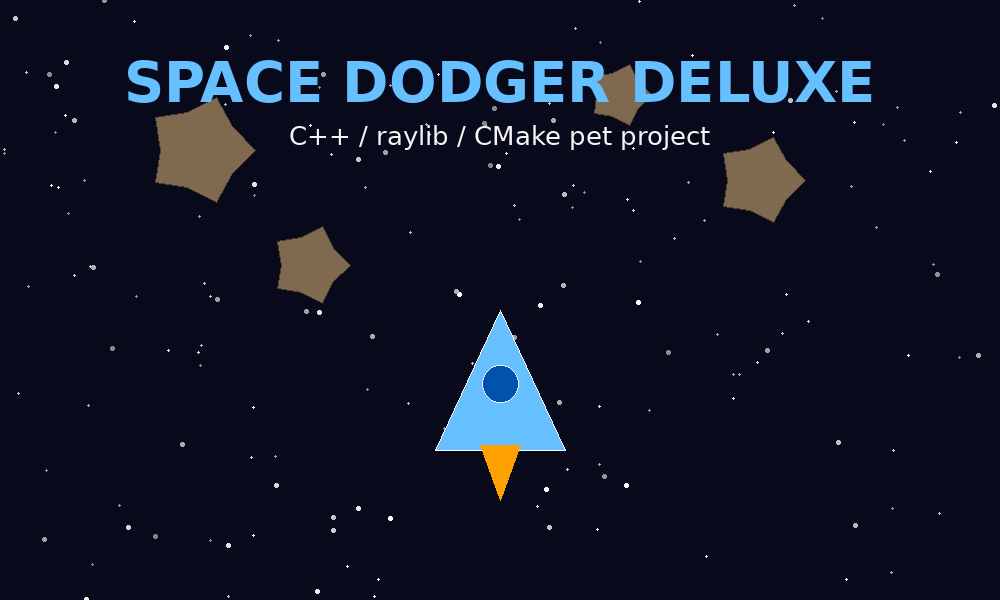

# Space Dodger Deluxe

A small but complete **C++ arcade game pet project** built with **raylib** and **CMake**.

You control a spaceship, dodge asteroids, collect bonus pickups and try to beat your high score.
The project is intentionally written in a simple educational style so it can be used as a portfolio project and as a learning base for C++ game development.

## Gameplay

- Move the spaceship with `WASD` or arrow keys.
- Dodge falling asteroids.
- Collect yellow bonus pickups for extra score.
- Collect blue shield pickups to survive one dangerous collision window.
- Press `P` to pause.
- Press `R` on Game Over to restart.
- Press `Esc` to return to the menu.

## Screenshots



After you run the game, add your own gameplay screenshots here:

```text
assets/screenshots/menu.png
assets/screenshots/gameplay.png
assets/screenshots/game-over.png
```

Example markdown for GitHub:

```md

```

## Project structure

```text
space-dodger-deluxe/
├── .github/workflows/build.yml   # GitHub Actions build check
├── assets/                       # Future textures, sounds and screenshots
├── docs/                         # Learning notes and architecture description
├── include/                      # Header files
├── src/                          # C++ source files
├── CMakeLists.txt                # Build configuration
├── LICENSE
└── README.md
```

## Requirements

You need:

- C++ compiler with C++17 support
- CMake 3.20+
- Git
- Internet connection during the first CMake configure step, because CMake downloads raylib automatically

Recommended tools on Windows:

- Visual Studio 2022 with "Desktop development with C++"
- or MinGW-w64 + CMake
- or CLion / Visual Studio Code with CMake Tools

## Build and run

### Windows / Linux / macOS

```bash
cmake -S . -B build -DCMAKE_BUILD_TYPE=Release
cmake --build build --config Release
```

Run the executable:

```bash
# Windows, Visual Studio generator
./build/Release/space_dodger.exe

# Windows, MinGW generator
./build/space_dodger.exe

# Linux/macOS
./build/space_dodger
```

## Upload to GitHub

Create an empty repository on GitHub, then run:

```bash
git init
git add .
git commit -m "Initial Space Dodger Deluxe game"
git branch -M main
git remote add origin https://github.com/YOUR_LOGIN/space-dodger-deluxe.git
git push -u origin main
```

Replace `YOUR_LOGIN` with your GitHub username.

## What this project demonstrates

This project is useful for a junior C++/game-dev portfolio because it demonstrates:

- C++ classes and object-oriented structure
- game loop architecture
- frame-independent movement with delta time
- procedural drawing
- collision detection
- random spawning
- pause/menu/game-over states
- score and high-score saving
- CMake project setup
- GitHub Actions build check

## Possible improvements

Good next features for learning:

1. Add real spaceship and asteroid textures.
2. Add sound effects and background music.
3. Add shooting mechanics.
4. Add health points.
5. Add different enemy types.
6. Add difficulty levels.
7. Add a settings screen.
8. Save high score in JSON.
9. Add unit tests for small utility functions.
10. Build a web version with Emscripten.

## License

MIT License.
